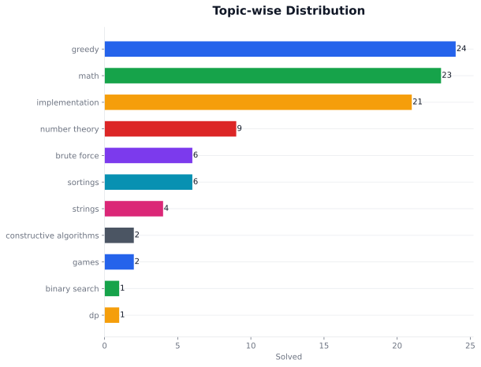
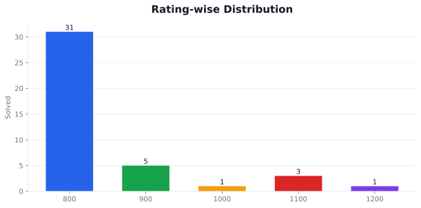
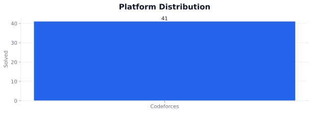
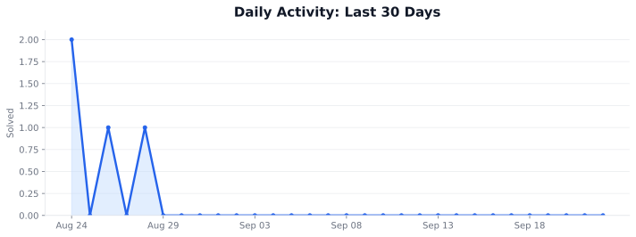
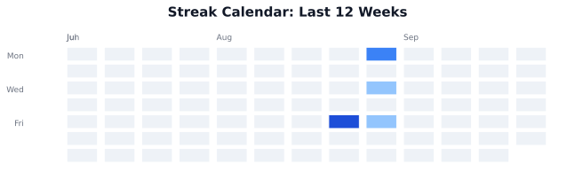

# CP & DSA Streak Tracker

A personal competitive programming dashboard focused on Codeforces consistency, problem volume, topic coverage, rating growth, and daily execution.

## About

**Abhijeet Ranjan** is building a consistent competitive programming record through a Codeforces-first practice system. Current focus: **Become strong in CP, DSA, DevOps and Open Source**.

## Coding Profiles

| Platform | Handle | Link |
| --- | --- | --- |
| GitHub | Abhi190702 | [Profile](https://github.com/Abhi190702) |
| Codeforces | ZAck19_0 | [Profile](https://codeforces.com/profile/ZAck19_0) |

## Progress Overview

| Metric | Value |
| --- | --- |
| Total solved | 34 |
| Current streak | 0 day(s) |
| Longest streak | 8 day(s) |
| Platforms tracked | 1 |
| Codeforces handle | ZAck19_0 |
| Codeforces rating | 734 |
| Last updated | 2026-07-14T05:10:01Z |

## Codeforces Snapshot

| Codeforces Metric | Value |
| --- | --- |
| Handle | ZAck19_0 |
| Current rating | 734 |
| Max rating | 734 |
| Current rank | newbie |
| Max rank | newbie |
| Contribution | 0 |
| Friend of count | 0 |
| Last fetched | 2026-07-14T05:09:56Z |

## Streak Performance

No active streak today. Longest streak so far: **8 day(s)**.

Total logged problems: **34**. Latest active month: **2026-06** with **5** solved problem(s).

## Weekly Progress

| Week | Solved |
| --- | --- |
| 2026-W23 | 5 |
| 2025-W52 | 7 |
| 2025-W51 | 15 |
| 2025-W50 | 6 |
| 2025-W49 | 1 |

## Monthly Progress

| Month | Solved |
| --- | --- |
| 2026-06 | 5 |
| 2025-12 | 29 |

## Topic-wise Distribution

| Topic | Solved |
| --- | --- |
| greedy | 21 |
| math | 19 |
| implementation | 18 |
| number theory | 7 |
| brute force | 6 |
| sortings | 4 |
| strings | 4 |
| games | 2 |
| binary search | 1 |
| constructive algorithms | 1 |
| dp | 1 |

## Rating-wise Distribution

| Rating | Solved |
| --- | --- |
| 800 | 27 |
| 900 | 3 |
| 1000 | 1 |
| 1100 | 2 |
| 1200 | 1 |

## Platform Distribution

| Platform | Solved |
| --- | --- |
| Codeforces | 34 |

## Daily Activity Graph

## Streak Calendar

## Latest Solved Problems

| Date | Platform | Problem | Rating | Topics | Solution |
| --- | --- | --- | --- | --- | --- |
| 2026-06-05 | Codeforces | [Domino piling](https://codeforces.com/problemset/problem/50/A) | 800 | math, greedy | [cpp](solutions/codeforces/800/50A_Domino_piling.cpp) |
| 2026-06-04 | Codeforces | [Next Round](https://codeforces.com/problemset/problem/158/A) | 800 | implementation | [cpp](solutions/codeforces/800/158A_Next_Round.cpp) |
| 2026-06-03 | Codeforces | [Team](https://codeforces.com/problemset/problem/231/A) | 800 | implementation | [cpp](solutions/codeforces/800/231A_Team.cpp) |
| 2026-06-02 | Codeforces | [Way Too Long Words](https://codeforces.com/problemset/problem/71/A) | 800 | strings, implementation | [cpp](solutions/codeforces/800/71A_Way_Too_Long_Words.cpp) |
| 2026-06-01 | Codeforces | [Watermelon](https://codeforces.com/problemset/problem/4/A) | 800 | math, implementation | [cpp](solutions/codeforces/800/4A_Watermelon.cpp) |
| 2025-12-26 | Codeforces | [Stock Arbitraging](https://codeforces.com/problemset/problem/1150/A) | 800 | greedy, implementation | No local solution |
| 2025-12-23 | Codeforces | [Blackslex and Password](https://codeforces.com/problemset/problem/2179/A) | 800 | math, strings | No local solution |
| 2025-12-23 | Codeforces | [Blackslex and Showering](https://codeforces.com/problemset/problem/2179/B) | 800 | dp, greedy, implementation | No local solution |
| 2025-12-23 | Codeforces | [Blackslex and Number Theory](https://codeforces.com/problemset/problem/2179/C) | 1100 | implementation, math, number theory, sortings | No local solution |
| 2025-12-22 | Codeforces | [Neko Finds Grapes](https://codeforces.com/problemset/problem/1152/A) | 800 | greedy, implementation, math | No local solution |

## Dashboard System

| Layer | Details |
| --- | --- |
| Data source | Codeforces API plus local solution metadata |
| Storage | JSON files under `data/` |
| Readme assets | SVG graphs under `assets/graphs/` |
| Refresh flow | GitHub Actions and local Python generators |
| Last generated | 2026-07-14T05:10:01Z |
